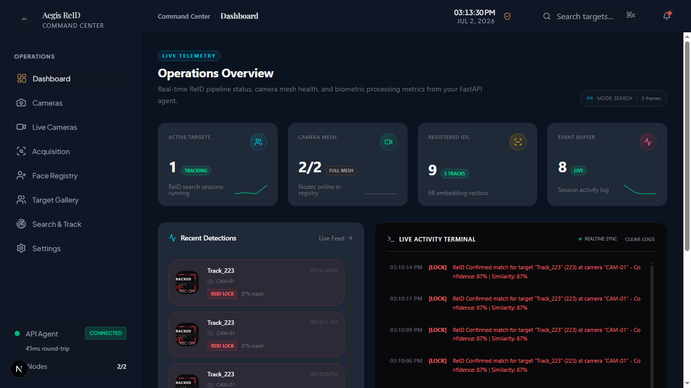
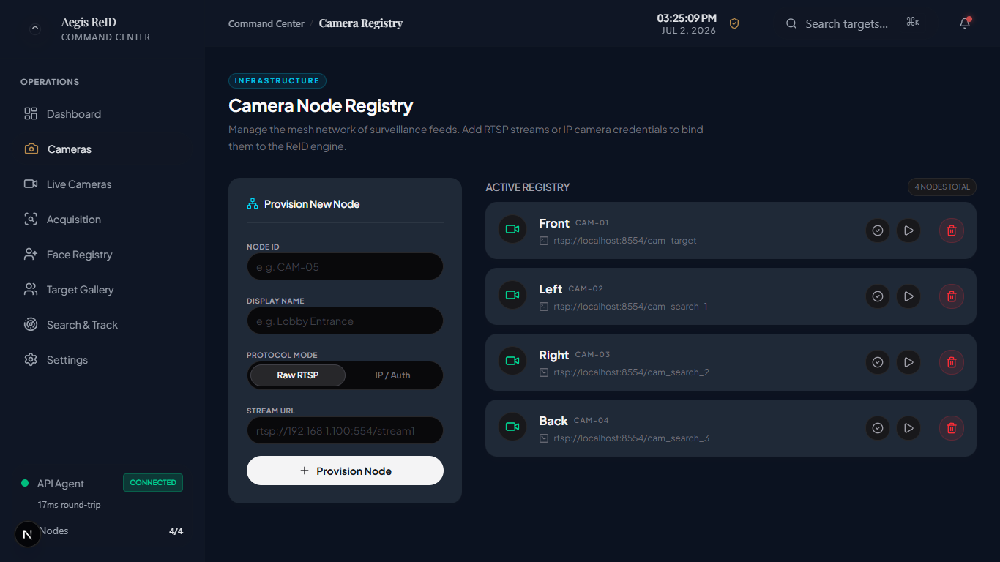
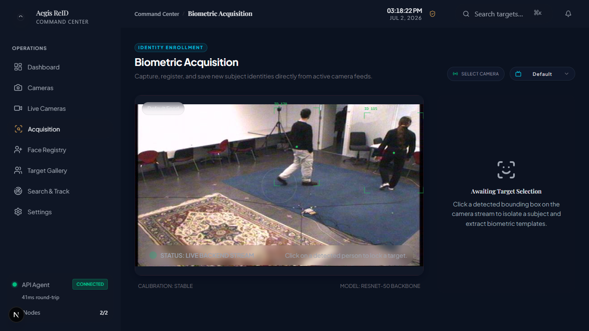
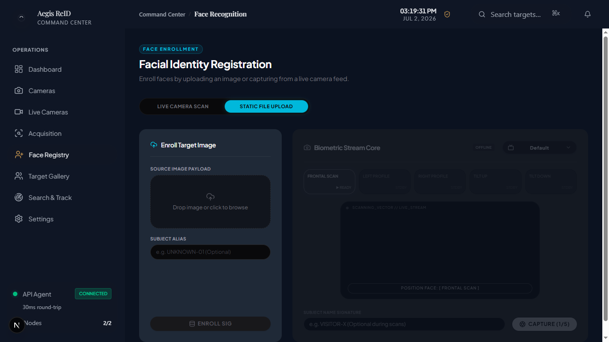
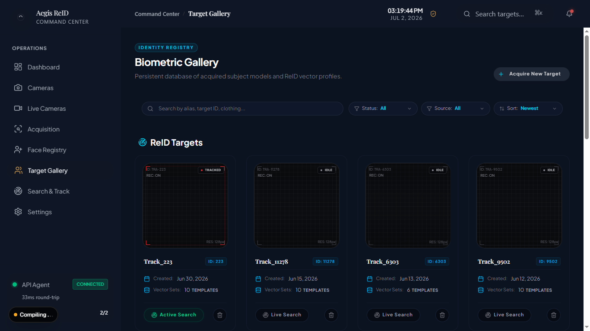
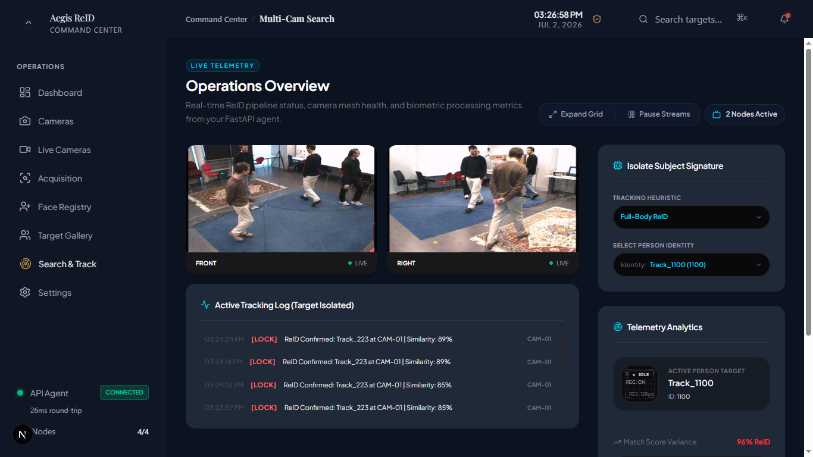
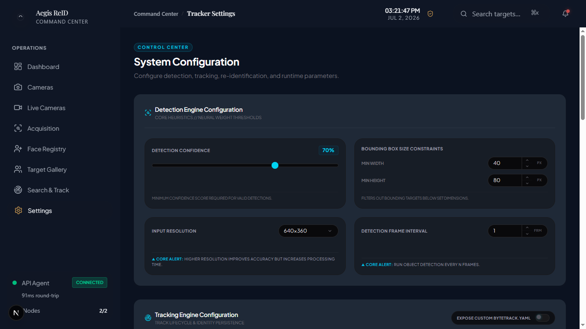

# Aegis ReID

<p align="center">
  
</p>

<p align="center">
  <b>Multi-Camera Person Re-Identification and Search Platform</b><br>
  Real-time biometric search, acquisition and identity management built using FastAPI, Next.js, YOLO and ReID embeddings.
</p>

<p align="center">
  
  
  
  
  
  
</p>

---

# Overview

Aegis ReID is a real-time surveillance intelligence platform designed to identify and search for individuals across multiple camera streams using appearance-based biometric signatures instead of traditional tracking IDs.

Unlike conventional object trackers that lose identity after occlusion or camera transitions, Aegis ReID relies on persistent embedding signatures generated from a person's appearance, allowing re-identification across cameras and after track loss.

The project combines:

- Multi-camera tracking
- Person Re-Identification (ReID)
- Face Recognition
- Hybrid Search
- Identity acquisition workflows
- Real-time telemetry
- Interactive dashboard and analytics

---

# Features

## Multi-Camera Search

- Search for individuals across multiple camera feeds simultaneously.
- Search sessions persist while navigating between pages.
- Dedicated search visualization pipeline.
- Search result overlays with similarity scores.
- Search events and telemetry generation.
- Search independent of acquisition workflow.

---

## Biometric Acquisition

- Click on a detected individual to begin acquisition.
- Automatic embedding collection over time.
- Reference embedding initialization.
- Similarity filtered acquisition pipeline.
- Rolling centroid reference updates.
- Best preview image selection.
- Acquisition survives temporary track loss.

---

## Face Registry

- Register identities using uploaded images.
- Static image face enrollment.
- Persistent face identity database.
- Face profile gallery support.

---

## Hybrid Search

Combine:

- Face Recognition
- Full Body ReID

to improve search accuracy in crowded scenes and difficult viewpoints.

---

## Camera Management

- RTSP stream registration.
- Camera health monitoring.
- Multi-camera worker orchestration.
- Camera switching support.
- Automatic recovery mechanisms.

---

## Runtime Configuration

Configure:

- Detection confidence
- Search similarity threshold
- Acquisition similarity threshold
- Confirmation hits
- Soft decay rate
- Detection interval
- Bounding box constraints
- Tracking heuristics

without restarting the application.

---

# Architecture

```text
RTSP Cameras
      │
      ▼
Camera Workers
      │
 ┌───────────────┐
 │ YOLO Detector │
 └───────────────┘
      │
      ▼
 ByteTrack Tracker
      │
      ▼
 ReID Embeddings
      │
      ▼
 Search Engine
      │
      ▼
 Match Aggregator
      │
      ▼
 FastAPI Backend
      │
      ▼
 Next.js Dashboard
```

---

# Technology Stack

## Backend

- FastAPI
- Uvicorn
- OpenCV
- ONNX Runtime
- PyTorch
- TorchReID
- NumPy

## Frontend

- Next.js
- React
- TypeScript
- Tailwind CSS

## AI Models

- YOLO Detection Model
- ByteTrack Multi Object Tracker
- OSNet Person ReID Model
- Face Recognition Pipeline

---

# Project Structure

```text
app/
├── api/
├── core/
├── reid/
├── schemas/
├── services/
├── utils/
└── models/

frontend/
├── src/
│   ├── app/
│   ├── components/
│   ├── hooks/
│   └── services/

data/
├── payloads/
├── previews/
├── faces/
└── cameras.json
```

---

# Screenshots

## Dashboard

Real-time telemetry, event monitoring and operational overview.



---

## Camera Registry

Manage RTSP streams and surveillance nodes.



---

## Biometric Acquisition

Capture embeddings directly from live camera streams.



---

## Face Registry

Register and manage face identities.



---

## Target Gallery

Persistent storage for acquired ReID identities.



---

## Multi-Camera Search

Real-time person search across multiple camera feeds.



---

## Runtime Configuration

Configure detection and tracking behaviour without code changes.



---

# Current Capabilities

- ✅ Multi-camera person search
- ✅ Persistent search sessions
- ✅ ReID target acquisition
- ✅ Face registry
- ✅ Hybrid search architecture
- ✅ Runtime configuration
- ✅ Search event telemetry
- ✅ Search overlays
- ✅ Camera registry
- ✅ Target gallery

---

# Known Limitations

- ReID inference currently runs on CPU.
- Search performance depends on camera quality and target visibility.
- Hardware limitations may affect real-time performance on low-end systems.
- Face and body identities are currently managed separately.

---

# Planned Improvements

## Search Improvements

- Persistent red target bounding boxes after confirmation.
- Target state persistence during temporary similarity drops.
- Multi-target simultaneous search.
- Cross-camera confidence fusion.

## Acquisition Improvements

- Continue acquisition for existing identities.
- Resume interrupted acquisition sessions.
- Alias based identity management.
- Better acquisition previews.

## UI Improvements

- Improved pause/resume stream handling.
- Search replay functionality.
- Timeline view of detections.
- Search heatmaps and analytics.

## Performance Improvements

- ONNX-based ReID inference.
- GPU accelerated embedding generation.
- FAISS vector indexing.
- PostgreSQL event storage.
- Distributed worker architecture.

---

# Dataset and Media Attribution

Development and testing were performed using publicly available surveillance videos, sample RTSP streams and benchmark datasets.

The purpose of this project is to demonstrate the underlying computer vision architecture and search pipeline rather than dataset creation.

---

# Installation

```bash
git clone https://github.com/labheshY/Aegis-ReID.git

cd aegis-reid

docker-compose up --build
```

---

# Future Roadmap

## v1.0
- [x] Multi-camera search
- [x] Search persistence
- [x] Acquisition persistence
- [x] Face registry
- [x] Runtime configuration

## v1.1
- [ ] Persistent target lock state
- [ ] Alias based identities
- [ ] Improved pause functionality
- [ ] Enhanced telemetry

## v2.0
- [ ] ONNX ReID pipeline
- [ ] FAISS search backend
- [ ] PostgreSQL metadata storage
- [ ] Distributed camera workers
- [ ] Enterprise deployment support

---

# Author

**Labhesh Yawalkar**

M.Tech Mechatronics | Computer Vision | Data Analytics | AI Engineering

---

# License

MIT License

---

> Building practical AI systems that bridge computer vision research and real-world surveillance workflows.